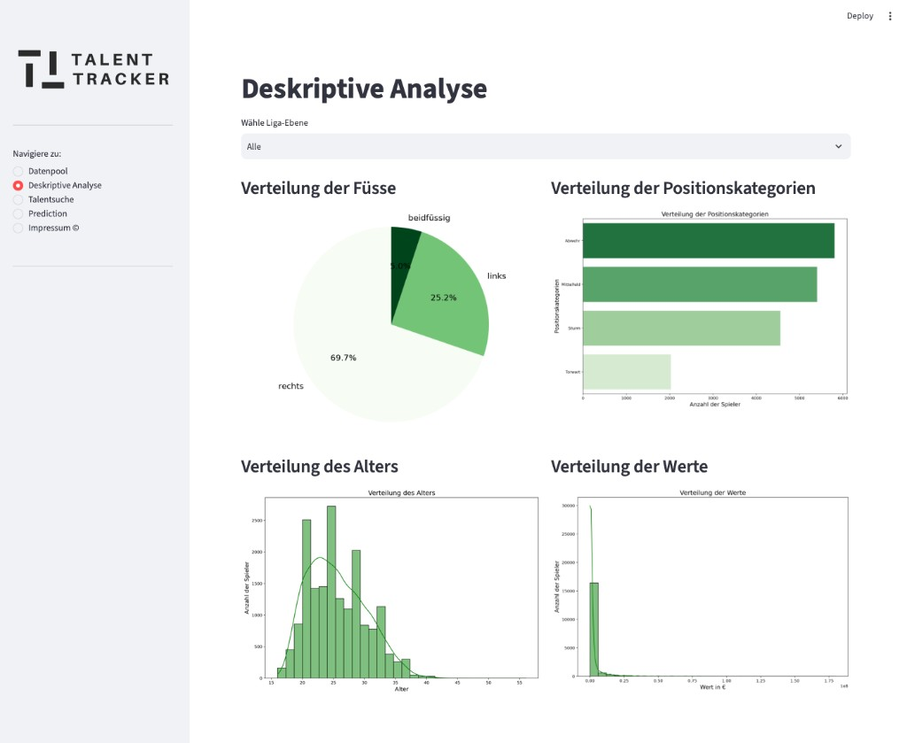
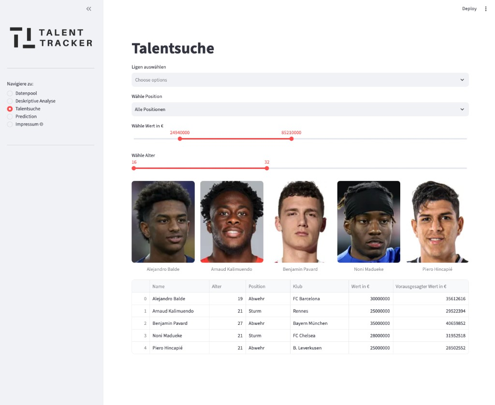

# Football Predictions — Talent Tracker (XgBoost)

Machine-learning project that estimates **football player market values** (Transfermarkt-style data) and highlights **under- and over-valued** players. Includes a **Streamlit** dashboard for exploration, descriptive analysis, talent search, and live predictions with position-specific **XGBoost** models.

## Overview

| Deskriptive Analyse | Talentsuche (undervalued players) |
| --- | --- |
|  |  |

## What it does

1. **Scrape** player pages from Transfermarkt (Selenium workers, configurable via `scraping/config.yaml`)  
2. **Clean & merge** scraped CSVs into modeling tables  
3. **Train & evaluate** “simple” and “extensive” models (notebooks under `analysis/`)  
4. **Serve** insights via Streamlit (`streamlit/app_v0.py`)  

Public demo (may be stale): [Streamlit Cloud app](https://onzolof-footballpredictions-streamlitapp-v0-3hmugi.streamlit.app/)

## Repository layout

| Path | Purpose |
|------|---------|
| `scraping/` | `manager.py`, `worker.py`, raw `scraped_data/`, cleansing notebooks |
| `analysis/` | Jupyter notebooks — EDA, preprocessing, training, performance CSVs |
| `data/` | Processed CSVs and prediction outputs for the app |
| `models/` | Pickled XGBoost models (`simple-model-xgb.pkl`, goalkeeper variant, extensive models) |
| `streamlit/` | Dashboard entrypoint and slim `requirements.txt` |

## Run the dashboard locally

Paths in `app_v0.py` are relative to the **repository root** (`data/`, `models/`).

```bash
cd FootballPredictions
python3 -m venv .venv
source .venv/bin/activate
pip install -r streamlit/requirements.txt
streamlit run streamlit/app_v0.py
```

Open [http://localhost:8501](http://localhost:8501).

Required artifacts (committed in this repo):

- `data/df_model_full_merge.csv`, `df_simple_model_*_streamlit.csv`  
- `models/*.pkl`  

## Re-run the data pipeline (optional)

Scraping is ** brittle** (site layout, `chromedriver`, legal/ToS). For portfolio purposes, rely on committed `data/` and `models/`.

High-level steps documented in notebooks:

1. `scraping/manager.py` → raw files in `scraping/scraped_data/`  
2. `scraping/data_cleansing.ipynb` → cleansed tables  
3. `analysis/empty_values.ipynb` → `data/df_clean.csv`  
4. Preprocessing notebooks per model → `data/df_*_model_*.csv`  
5. Model notebooks → `data/*_results.csv` and `models/*.pkl`  
6. `analysis/model_predictions_full_merge.ipynb` → `df_model_full_merge.csv`  

## Ethics & data

Transfermarkt data was used for academic analysis. Do not use scrapers against third-party sites without respecting terms of service and robots rules. This repository is for demonstrating methodology, not for production scraping.

## License

[MIT License](LICENSE) — University of St.Gallen course project; Transfermarkt data subject to their terms of use.
